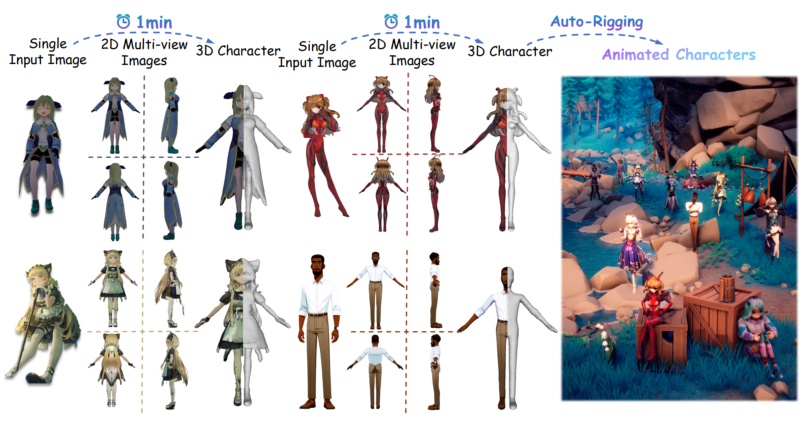

# [Project Page](https://charactergen.github.io/)

CharacterGen takes a single input image and generates 3D pose-unified character meshes with high-quality and consistent appearance, which can be directly utilized in downstream rigging and animation workflows.



# [Download paper](https://arxiv.org/pdf/2402.17214.pdf)

Bibtex citation: 
```
@article{peng2024charactergen,
  title   ={CharacterGen: Efficient 3D Character Generation from Single Images with Multi-View Pose Canonicalization}, 
  author  ={Hao-Yang Peng and Jia-Peng Zhang and Meng-Hao Guo and Yan-Pei Cao and Shi-Min Hu},
  journal ={ACM Transactions on Graphics (TOG)},
  year    ={2024},
  volume  ={43},
  number  ={4},
  doi     ={10.1145/3658217}
}
```